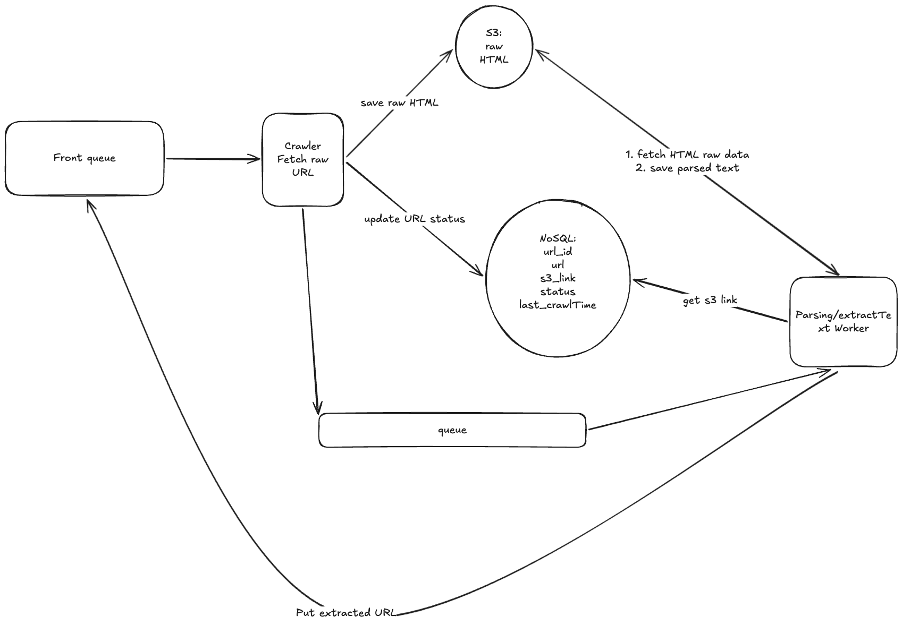

# Parallel Web Crawler

A scalable, multi-threaded web crawler built in Java that demonstrates concurrent programming, rate limiting, and system design principles. This project showcases parallel processing with thread-safe components and polite web crawling practices.


##  Features

- **Multi-threaded Architecture**: Separate thread pools for fetching and parsing
- **Thread-Safe URL Management**: Concurrent queues with duplicate detection
- **Rate Limiting**: Per-domain politeness with configurable delays
- **Robots.txt Compliance**: Respects website crawling policies
- **Duplicate Detection**: URL normalization and database-backed deduplication
- **Content Hashing**: Detects duplicate content across different URLs
- **Graceful Shutdown**: Completes in-flight tasks before termination
- **Persistent Storage**: Raw HTML and parsed content stored separately
- **Scalable Design**: Easily adjustable thread pools and queue sizes

##  Architecture

The crawler follows a **producer-consumer pattern** with two main processing stages:

```
┌─────────────┐
│ Front Queue │ ← Seed URLs + Discovered URLs
└──────┬──────┘
       │
       ▼
┌─────────────────┐
│ Crawler Threads │ → Fetch HTML → Save to Storage → Update DB
└────────┬────────┘
         │
         ▼
┌──────────────────┐
│ Processing Queue │
└────────┬─────────┘
         │
         ▼
┌────────────────┐
│ Parser Threads │ → Extract Text → Discover URLs → Loop Back
└────────────────┘
```

### Architecture Diagram



##  System Components

### 1. **Front Queue (URL Frontier)**
- **Purpose**: Manages URLs waiting to be crawled
- **Type**: Thread-safe `ConcurrentLinkedQueue`
- **Features**:
    - Receives seed URLs at startup
    - Accepts newly discovered URLs from parser
    - Duplicate check via database before enqueueing
    - URL normalization (lowercase, remove fragments, sort params)

### 2. **Crawler Threads**
- **Purpose**: Fetch raw HTML content from web pages
- **Thread Pool**:  5 threads
- **Responsibilities**:
    - Poll URLs from Front Queue
    - Check robots.txt compliance
    - Apply per-domain rate limiting (politeness delays)
    - Fetch HTML via HTTP client
    - Save raw HTML to storage (S3 or local filesystem)
    - Update database with fetch status and storage link
    - Enqueue to Processing Queue

### 3. **Processing Queue**
- **Purpose**: Internal queue between crawler and parser
- **Type**: Thread-safe `ConcurrentLinkedQueue`
- **Features**:
    - Decouples fetching from parsing
    - Enables independent scaling of crawler/parser threads
    - Buffering for bursty crawl patterns

### 4. **Parser Threads**
- **Purpose**: Extract content and discover new URLs
- **Thread Pool**:  5 threads
- **Responsibilities**:
    - Poll URLs from Processing Queue
    - Fetch raw HTML from storage via database link
    - Parse HTML using JSoup
    - Extract clean text content
    - Compute content hash (MD5/SHA-256)
    - Save parsed text to storage
    - Discover all links in the page
    - Normalize and validate discovered URLs
    - Check database for duplicates
    - Add new URLs to Front Queue

### 5. **Metadata Database**
- **Purpose**: Persistent URL and crawl state tracking
- **Type**: MongoDB


### 6. **Storage Layer**
- **Purpose**: Persist HTML content and parsed text
- **Types**:
    - **Raw HTML**: Original webpage source
    - **Parsed Text**: Extracted clean text content
- **Implementation**: Local filesystem or S3-compatible storage


### 7. **Rate Limiter**
- **Purpose**: Enforce politeness policies per domain
- **Algorithm**: Token bucket / leaky bucket
- **Features**:
    - Per-domain tracking with `ConcurrentHashMap`
    - Configurable delay (default: 1-2 seconds)
    - Prevents server overload
    - Thread-safe domain coordination

### 8. **Robots.txt Parser**
- **Purpose**: Respect website crawling policies
- **Features**:
    - Fetch and parse `/robots.txt` per domain
    - Cache parsed rules in database
    - Check user-agent matching
    - Respect `Disallow` and `Crawl-delay` directives
    - Thread-safe cache access


##  Getting Started

### Prerequisites

- Java 17+
- Maven 3.8+
- MongoDB running locally

```bash
# Install MongoDB (macOS)
brew tap mongodb/brew
brew install mongodb-community
brew services start mongodb-community
```

### Installation & Run

1. **Clone the repository**
   ```bash
   git clone https://github.com/yourusername/parallel-web-crawler.git
   cd parallel-web-crawler/url-crawler
   ```

2. **Add your seed URLs** — edit `src/main/java/com/crawler/Main.java` line 20:
   ```java
   seeds = List.of(
       "https://yoursite.com",
       "https://anothersite.com"
   );
   ```

3. **Build the project**
   ```bash
   mvn package -q
   ```

4. **Run with hardcoded seeds**
   ```bash
   java -cp "target/url-crawler.jar:target/dependency/*" com.crawler.Main
   ```

   **Or pass URLs directly as arguments (no recompile needed)**
   ```bash
   java -cp "target/url-crawler.jar:target/dependency/*" com.crawler.Main \
     https://yoursite.com \
     https://anothersite.com
   ```

5. **View results**
   - **MongoDB Compass** → `mongodb://localhost:27017` → database `crawler` → collection `url_records`
   - **Raw HTML** → `crawl_data/{domain}/{hash}.html`
   - **Extracted text** → `crawl_data/{domain}/{hash}.txt`
   - **Logs** → `logs/crawler.log`


### Duplicate Prevention

**URL Deduplication:**
- Normalize URLs (lowercase, remove fragments, sort parameters)
- Check database before adding to queue
- Skip if URL exists with status='completed' or 'pending'

**Content Deduplication:**
- Compute hash of cleaned text content
- Store hash in database
- Can detect identical content across different URLs
- Query: `SELECT url FROM crawled_urls WHERE content_hash = ?`

### Shutdown Phase
1. Stop accepting new seed URLs
2. Signal all threads to stop after current task
3. Wait for in-flight HTTP requests to complete
4. Wait for queues to drain
5. Close database connections
6. Close thread pools gracefully
7. Log final statistics


### Optimization Recommendations 

 - **Increase thread counts** for more parallelism (balance with rate limiting)
- **Adjust rate limiting** based on target website's capacity
- **Use SSD storage** for faster I/O operations
- **Tune JVM heap size**: `-Xmx2g -Xms1g`
- **Database connection pooling** for high concurrency

- **Bloom Filter**: Memory-efficient duplicate detection
-  **Priority Queue**: Prioritize URLs by importance/freshness
-  **Distributed Crawling**: Scale across multiple machines
-  **JavaScript Rendering**: Support for SPA applications (Selenium/Playwright)
-  **Sitemap.xml Support**: Faster discovery of URLs
-  **Content Type Filtering**: Skip binary files (PDF, images)
-  **Web UI Dashboard**: Real-time monitoring and control
-  **Export Functionality**: CSV, JSON, Elasticsearch integration
-  **Incremental Crawling**: Re-crawl only changed pages
-  **Kafka Integration**: Replace in-memory queues for distributed setup


**Note**: This crawler is designed for educational purposes. Always respect website terms of service, robots.txt, and rate limits when crawling.